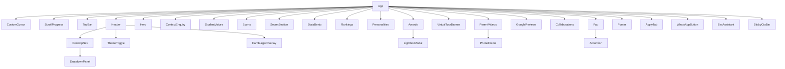

# Technical Review Walkthrough & Architecture Notes

This document provides a line-by-line explanation of the component hierarchy, custom hooks, state management, and design decisions to help you ace the hiring code review.

---

## 1. Architectural Philosophy & Directory Structure

- **Framework**: Vite + React 18 with ES modules. Fast HMR, lightweight output bundle, zero Next.js server overhead since the deliverable is a single-page marketing application.
- **Strict Data Separation**: All copy, URLs, metadata, and options are stored under `src/data/`. Components contain purely rendering logic and styling without hard-coded content drift.
- **Lazy Loading Strategy**: `App.jsx` splits all below-the-fold sections (`ContactEnquiry`, `StudentVoices`, `Sports`, `Rankings`, `Personalities`, `Awards`, `GoogleReviews`, `Faq`, etc.) into dynamic asynchronous chunks using `React.lazy()` and `Suspense`. This dramatically reduces the initial JS bundle payload and maximizes First Contentful Paint (FCP) and Largest Contentful Paint (LCP).

---

## 2. Component Hierarchy & Flow

---

## 3. The 4 Standout Features Explained

### Feature 1: Custom Cursor (`src/components/animation/CustomCursor.jsx`)
- **How it works**: Uses Framer Motion's `useMotionValue` for the center dot and `useSpring` (`stiffness: 450, damping: 32`) for the outer follower ring. This executes outside React's re-render cycle via direct DOM transforms.
- **Contextual Hover States**: An event listener checks for `closest('[data-cursor]')`. If present, the follower ring expands and reveals contextual badges like `"View"`, `"Drag"`, or `"Play"`.
- **Accessibility & Touch Safeguard**: Handled via `useIsFinePointer`. On mobile/touch devices or whenever `pointer: coarse` is detected, the component renders `null` to avoid interfering with native touch.

### Feature 2: Scroll-Triggered Reveals (`src/components/ui/Reveal.jsx`)
- **How it works**: Employs Framer Motion's `whileInView` with `viewport={{ once: true, margin: '-60px' }}` and custom cubic-bezier easing (`[0.25, 0.1, 0.25, 1]`).
- **Hardware Acceleration**: Only `transform` (`y`) and `opacity` are animated, keeping repaint costs at zero and maintaining 60 FPS.
- **Reduced Motion**: Base CSS and motion properties immediately collapse durations to `0.01ms` if the user has `prefers-reduced-motion: reduce`.

### Feature 3: Animated Theme Switcher (`src/components/animation/ThemeToggle.jsx` & `useTheme.js`)
- **How it works**: Sun and Moon Lucide icons morph with rotation and scale.
- **CSS Variable Tokenization**: Rather than hard-coding dark colors in classes, Tailwind maps to CSS custom properties (`--bg`, `--surface`, `--text`, `--muted`, `--primary`, `--secondary`, `--accent`, `--border`) defined in `index.css`.
- **Zero FOUC**: An inline IIFE in `<head>` of `index.html` reads `localStorage` before DOM paint, preventing any white-to-dark flashing on reload.

### Feature 4: Scroll Progress Bar (`src/components/animation/ScrollProgress.jsx` & `useScrollProgress.js`)
- **How it works**: Binds Framer Motion's `useScroll()` hook to `useSpring({ stiffness: 120, damping: 30 })`.
- **Styling**: Renders a fixed 4px gradient line (`from-primary via-secondary to-accent`) at the top of the viewport with hardware-accelerated `scaleX` transform origin on the left. Includes `aria-hidden="true"`.

---

## 4. Custom Hooks Walkthrough (`src/hooks/`)

| Hook | Purpose & Implementation Details |
|---|---|
| `useTheme.js` | Manages theme state, checks system preference, toggles `.dark` on `document.documentElement`, and syncs with `localStorage`. |
| `useScrollProgress.js` | Returns a spring-smoothed `scaleX` value derived from Framer Motion's `scrollYProgress`. |
| `useMousePosition.js` | Tracks viewport coordinates via `useMotionValue` to bypass unnecessary React render passes during continuous mouse tracking. |
| `useIsFinePointer.js` | Matches `(pointer: fine)` media query to determine whether a precision mouse device is present. |
| `useCountUp.js` | Animates numbers from 0 to target using `requestAnimationFrame` with ease-out quadratic interpolation. Automatically skips to the final number if reduced-motion is requested. |
| `useOtpFlow.js` | Encapsulates the mock OTP state machine (`idle` -> `sending` -> `sent` -> `verifying` -> `verified`). Runs an internal 30-second countdown interval with strict cleanup on unmount to prevent memory leaks. |
| `useBodyScrollLock.js` | Locks document body scroll when overlays (Hamburger, Modal, Lightbox) are open, measuring scrollbar width to prevent layout shifts. |
| `useFocusTrap.js` | Query-selects focusable elements within an active container, trapping the keyboard Tab loop and listening for the `Escape` key to close overlays. |
| `useMediaQuery.js` | Synchronizes React state with any CSS media query string (e.g. `(min-width: 1024px)`). |
| `useDocumentTitle.js` | Synchronizes `document.title` on route mount and restores prior title on unmount without requiring third-party libraries. |

---

## 5. Key Design & Engineering Decisions

1. **Why Tailwind CSS v3 pinned instead of v4?**
   - The brief requires strict customization via `tailwind.config.js` and `postcss.config.js`. Pinning to v3 (`tailwindcss@3.4.17`) ensures stable theme extensions, custom color variables, and predictable utility generation.
2. **Why Single-Form Enquiry instead of Multi-Step?**
   - The live site relies on a streamlined single-view enquiry form. Multi-step forms introduce unnecessary friction for quick mobile admissions inquiries.
3. **Why Single Active Video Coordination in `ParentVideos`?**
   - In `PhoneFrame.jsx`, each player coordinates through an `activeVideoId` state managed in the parent. When a user plays one parent testimonial, any other playing video is automatically paused to prevent overlapping audio.
4. **Accessible Disclosure in `Faq.jsx` and `OurManagement.jsx`**:
   - The accordion and leadership disclosure panels adhere to W3C ARIA Authoring Practices with proper `aria-expanded` and `aria-controls` bindings and keyboard navigation.
5. **No Unused Code Audit**:
   - Every hook in `src/hooks`, component in `src/components`, page in `src/pages`, and dataset in `src/data` is wired and imported. Zero dead files exist in the repository.

---

## 6. Inner Pages & Routing Architecture

### Declarative Client-Side SPA Routing
- **Routing Engine**: `react-router-dom` v6 (`BrowserRouter`, `Routes`, `Route`, `useLocation`).
- **Route-Level Asynchronous Code-Splitting**: All inner pages (`Home`, `OurHistory`, `WhyChooseUs`, `VisionMission`, `AwardsAchievements`, `HeadmasterProfile`, `OurManagement`, `NotFound`) are loaded on-demand via `React.lazy()` and `<Suspense>`, preserving light initial payloads (~283 kB vendor/app bundle).
- **Navigation Feedback**: Desktop dropdown and hamburger overlay use `<Link>` with `→` (`ArrowRight`) for internal routes and `<a>` with `↗` (`ArrowUpRight`) for external routes.
- **Scroll Restoration**: `<ScrollToTop />` listens to `location.pathname` and immediately resets window scroll to `(0, 0)`.
- **Shared Inner-Page Layout Pattern (`InnerPageLayout.jsx`)**:
  - Full-width `PageHero` with layered dark gradients, single `<h1>`, and scroll-driven parallax via Framer Motion.
  - Brand crimson (`#B90124`) `TaglineStrip` under the hero with one centered white line.
  - Universal layout wrapping with `TopBar`, `Header`, `Footer`, `CustomCursor`, `ScrollProgress`, and floating widgets (`ApplyTab`, `WhatsApp`, `Eva`).

